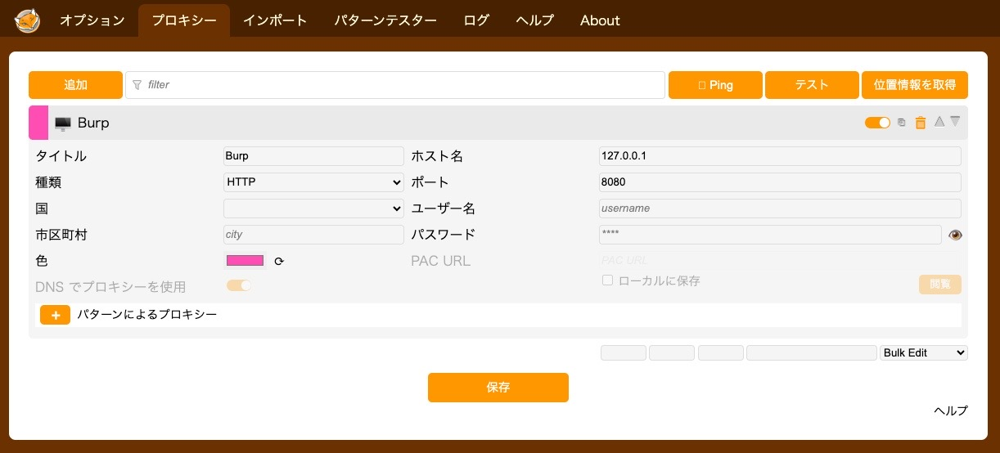
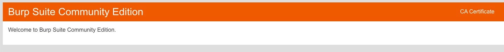

# Chromeの通信をBurp Suiteにプロキシする方法
## Burp Suiteとは？
Webアプリケーションの脆弱性ツール。  
今回はセキュリティ学習サイト・PortSwiggerの設問にて、リクエストを傍受して書き換えるために使う。  
Burp Suiteが通信を傍受するブラウザはデフォルトではChromiumとなっているが、  
Chromeで問題を解くことが多いので、Chromeの通信をプロキシすることにした。

## 手順
* OSによって異なります。以下はMacの場合の手順。
1. Chromeの拡張機能として、FoxyProxyを入手する
https://chromewebstore.google.com/detail/foxyproxy/gcknhkkoolaabfmlnjonogaaifnjlfnp?hl=ja
2. プロキシを作成する
Chromeの 拡張機能 > 拡張機能を管理 を開き、「拡張機能のオプション」をクリックするとFoxyProxyの設定画面を開く。  
「プロキシー」タブを開き、自分のPCの通信を8080番で待ち受けているBurp Suiteに中継するためのプロキシを作成する。  
**タイトル**: Burp  
**ホスト名**: 127.0.0.1  
**ポート**: 8080  
  
うまく行かない場合、Burp Suiteの待ち受けているポートが異なっている場合があるため、  
Burp SuiteのProxy > Proxy Setting > Proxy listenersから待ち受けているポートを確認する。  
3. プロキシを有効化する  
拡張機能を管理 を開き、ツールバーに固定する をクリックする。  
右上にFoxy Proxyのアイコンが表示されるので、そこから先ほど作成した「Burp」というプロキシを有効化。  
以下のURLをクリックし、画像のように表示されればプロキシできている。  
http://127.0.0.1:8080/
  
4. Burpの証明書をChromeに設定する  
http://127.0.0.1:8080/ の右上に「CA Certificate」というボタンがあるので、そこからダウンロードする。  
