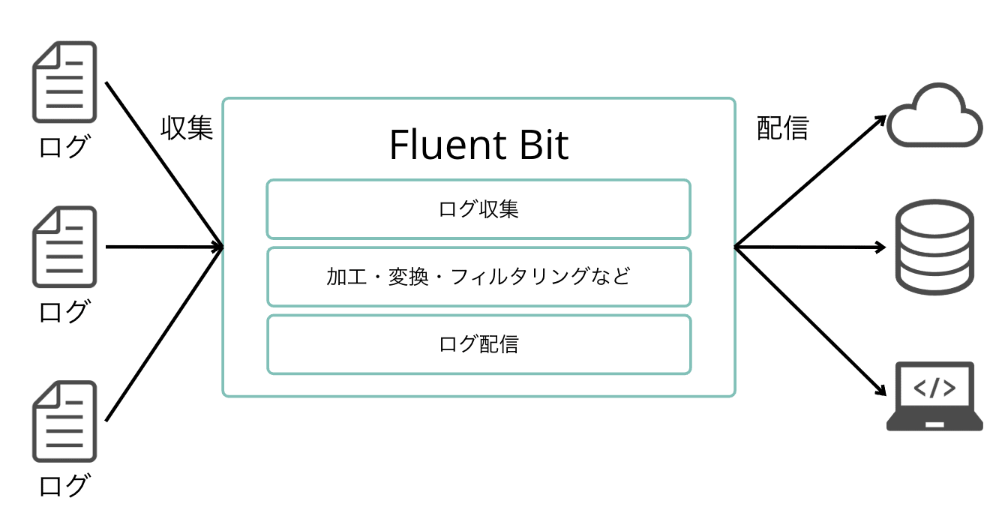
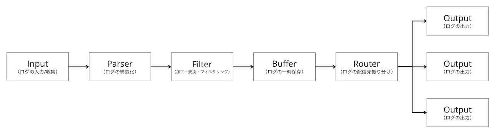

# ・Fluent Bitとは
アプリケーションのログの収集・加工・ルーティングを行うツール。  
以下の図のようにログの収集元が分かれているとき、複雑な加工が必要なとき、格納先のDBをいくつかに分けたいときなどに役立つ。

## 特徴
### プラガブルな設計
大きく分けて以下のような部分に分かれており、部分ごとに**プラグイン**で処理の仕方を指定する。プラグインは自分で開発することも可能。

### パフォーマンスの高さ
前身であるFluentd（Rubyで開発）に比べて、C言語でできているため省メモリで高速に動作する。