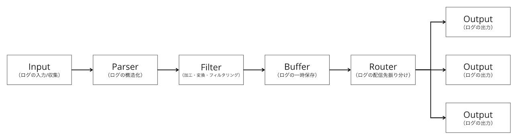

# Fluent Bitとは
アプリケーションのログの収集・加工・ルーティングを行うツール。  
以下の図のようにログの収集元が分かれているとき、複雑な加工が必要なとき、格納先のDBをいくつかに分けたいときなどに役立つ。


## 特徴
### プラガブルな設計
大きく分けて以下のような部分に分かれており、部分ごとに**プラグイン**で処理の仕方を指定する。プラグインは自分で開発することも可能。
  
プラグインには以下のような種類がある。
- Input  
データをHTTP、TCP、UDP、Syslogなどのデータソースから収集する。  
- Parser  
収集したログをJSONなどの形式に整形する。  
- Prosessor  
データの補完・変換などを行う。  
- Filter  
ログのマッチング、除外、強化を行う。  
- Routing  
どこからのInputをどこへ送るかを規定する。  
Tag-based routingは、  
```
pipeline:
  inputs:
    - name: cpu
      tag: my_cpu

    - name: mem
      tag: my_mem

  outputs:
    - name: es
      match: my_cpu

    - name: stdout
      match: my_mem
```
このようにあるtagのInputを、matchが一致するOutputにルーティングする。  
Routing with regular expressionsは、InputとOutputを正規表現でマッチングしてルーティングする。

### パフォーマンスの高さ
前身であるFluentd（Rubyで開発）に比べて、C言語でできているため省メモリで高速に動作する。