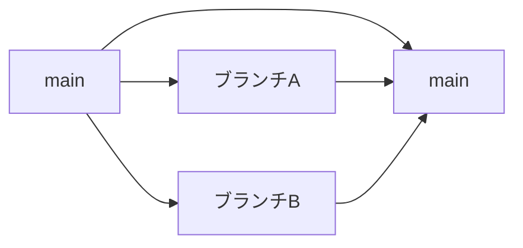

# Gitで複数ブランチのマージが衝突しない理由
結論からいうと、**差分をマージしてるから**。

Gitには**3way merge**という仕組みがあり、  
マージするときにはbase(共通の分岐元)からどう変わったかという差分だけを取り込む。  
AとBで同じ行を変更していた場合はどちらかがどちらかを上書きする可能性はある（またはコンフリクト発生）が、  
そうでなければどちらも無事マージされる。
