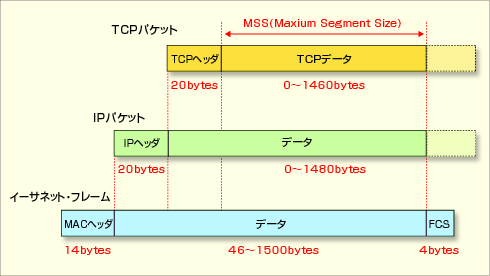

# ・IPSecとは
ネットワーク層でIPパケットを暗号化する技術。  
VPNを確立するときにもよく使われる。  
TLS通信はトランスポート層の暗号化方式なので、アプリケーション単位でのセキュリティ対策に用いられるのに対して、IPSecはネットワーク単位でのセキュリティ対策に使われる。

IPパケットは、**IPヘッダ**と**データ部**の2つの部分でできている。

トランスポートモード...データ部のみ暗号化。   
トンネルモード...IPヘッダも暗号化され、新しいIPヘッダが付与される。
後者は元のIPアドレスを秘匿できるため、社内LAN・外部PC間の通信などに向いている。
