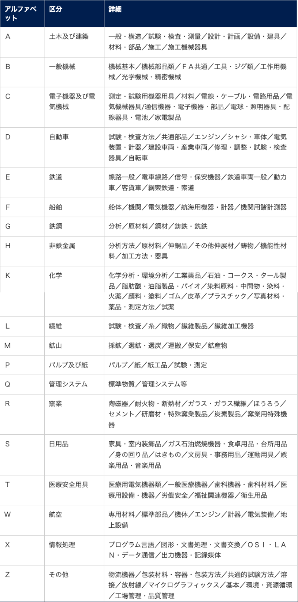

# JISとは
Japanese Industrial Standardsの略。  
日本の国家規格だが、海外への製品の輸出に備えてISOやIECなどの国際規格に準じている。  
以下の19種類の区分が存在する。

出典: https://www.keyence.co.jp/ss/products/marker/housing-design/knowledge/iso.jsp  

- JIS Q 20000-1
サービスマネジメントの要求事項を書いたもの。