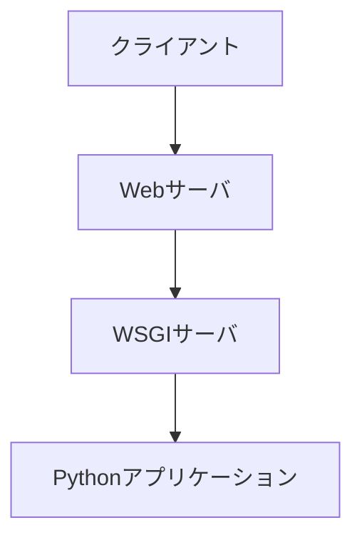

# ・WSGIとは
WebサーバとPythonアプリケーションの仲立ち。

## WSGIサーバの役割
Webサーバがクライアントからのリクエストを受け付け、HTTPリクエストをサーバサイドプログラムで処理するのだが、**Pythonは直接HTTPリクエストを処理できない。またWebサーバもPythonアプリケーションから返されたレスポンスが理解できない。**  
そこで登場するのがWSGIサーバ。図にすると以下の位置に入る。

### Webサーバ -> Pythonの処理時  
Webサーバが受け取ったHTTPリクエストをPythonアプリケーションが理解できる形に変換する。

### Python -> Webサーバの処理時  
Pythonアプリケーションが返すレスポンスをWebサーバが理解できるように変換する。

## WSGIサーバの具体例
Gunicorn、Waitress、Apacheに組み込まれたmod_wsgiなど。

## なぜ仲立ちが必要なの？
これはPHPの実行方法がベースにあるからこその疑問。  
言語ごとのWebサーバとの関係性は、だいたい以下の3パターン。

1. Webサーバが直接実行する  
   **PHP**、Perlなど

2. プロトコルなどの中間レイヤを通して通信する  
   **Python(WSGI)**、Java(Servlet)、C++(FastCGI)など

3. 言語にWebサーバが組み込まれている  
   Go、Node.jsなど

### 3の方法が取られなかった理由
Pythonにもhttp.serverという組み込みWebサーバがあるが、性能が低いので本番では基本的に使用されない。高性能なWebサーバを作れなかった理由は以下。
1. 動的型付け言語であるため、処理速度が遅い
2. goroutineや非同期I/OのようなWebサーバを作るのに有利な機能がない

### 1の方法が取られなかった理由
Python含む2の言語で1の方法が取られなかったのは、第一に**言語の設計思想の違い**、第二に**常駐プロセスとしても利用しづらいこと**が理由。PHPはリクエストごとにプロセスを立ち上げる事が前提で設計された言語だが、Python、Java、C++といった言語は、そういった使い方を想定して設計されていないので、同じことをするのは無駄が大きい。  
そこで、Pythonアプリケーションを常駐プロセスとして直接実行できるモジュールがApacheに設けられたが、

1. Pythonのマルチスレッド管理とApacheのプロセスモデルが合わない
2. モジュールの再読み込みの際、Apacheを再起動する必要がある
3. nginxなど他のWebサーバと互換性がない

といった理由で普及しなかった。